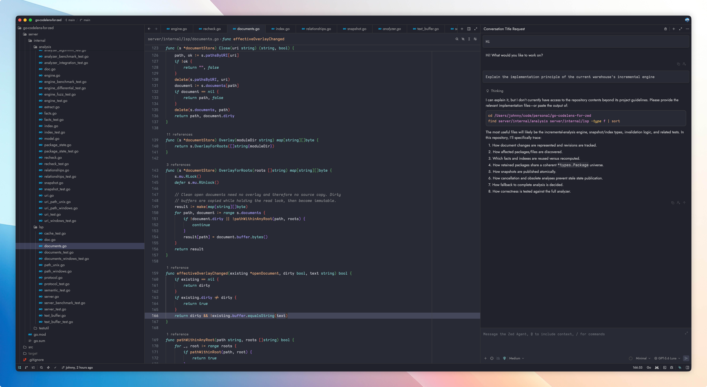
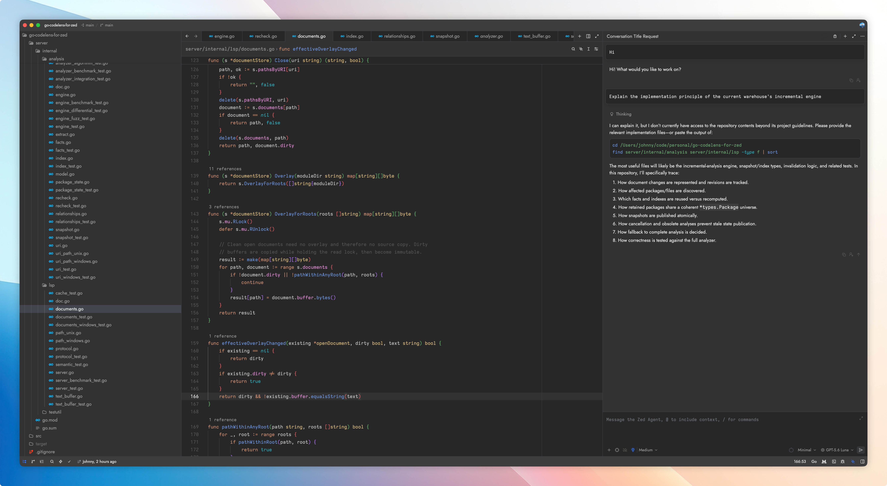
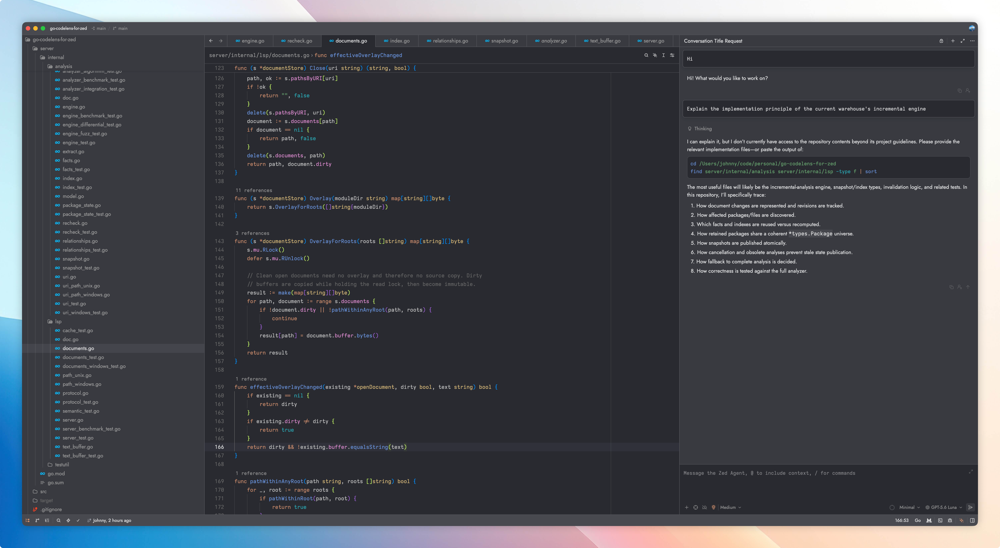
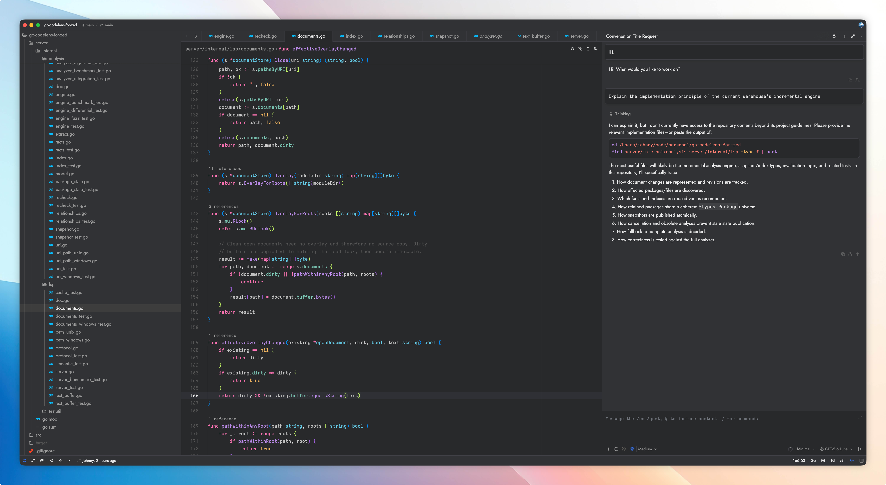
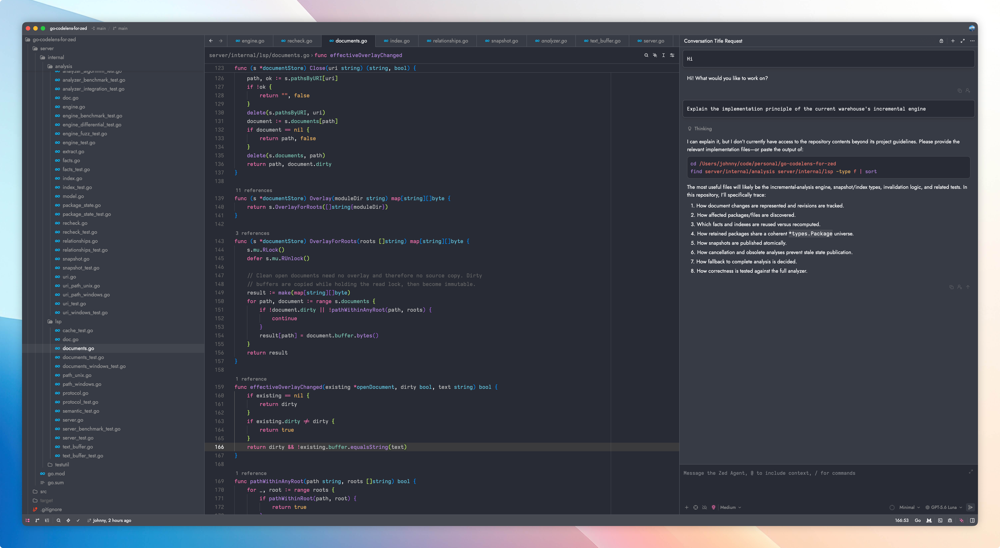

# Gorgeous Themes for Zed

Dark theme family for [Zed](https://zed.dev), inspired by JetBrains IDE and Xcode color schemes,
adapted and tuned for Zed (full v0.2.0 theme schema coverage, dark/soft variants per family).

## Themes

### Gorgeous - Fleet Palenight

### Gorgeous - JetBrains Dark

### Gorgeous - JetBrains Dark soft

### Gorgeous - Rider Dark

### Gorgeous - Rider Dark soft

### Gorgeous - Xcode Dark

### Gorgeous - Xcode Dark Soft

## Installation

1. Open Zed
2. Open the Extensions page (`zed: extensions`)
3. Search for "Gorgeous" and install
4. Select a Gorgeous theme via the theme selector (`theme selector`)

## Development

Install as a dev extension: `zed: install dev extension` and select this directory.

Themes are defined in `themes/Gorgeous.json`, conforming to the
[Zed theme schema v0.2.0](https://zed.dev/schema/themes/v0.2.0.json).

## License

[MIT License](LICENSE).
